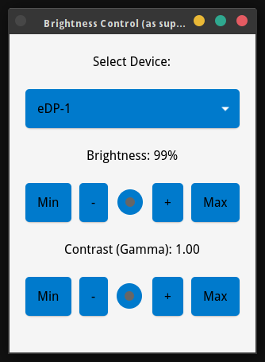

## Brightness and Contrast Control Application

This is a simple brightness and contrast control application built with Python and GTK4. It allows users to adjust the brightness of their connected monitors using a graphical interface. The application detects connected displays, and users can select a display and adjust the brightness using a slider or predefined buttons.

### Features
- Select from multiple connected monitors.
- Adjust brightness using a horizontal slider.
- Predefined buttons for setting brightness to minimum (20%) or maximum (100%).

### Prerequisites
- **Python 3.11+**
- **GTK 4.0+**
- The `gi` Python package (GObject Introspection).
- `xrandr` installed on your system (used for detecting monitors and adjusting brightness).

### Installation

1. Install the required packages:

   On FreeBSD-based systems:
   ```bash
   sudo pkg install python py311-gobject3 gtk4 xrandr 
   ```

2. Clone the repository:
   ```bash
   git clone https://github.com/vimanuelt/brightness-control.git
   cd brightness-control
   ```
3. Make it executable:
   ```bash
   chmod +x brightness-control.py
   ```

4. Run the application:
   ```bash
   ./brightness-control.py
   ```

### Usage
1. Upon starting the application, it will automatically detect connected monitors via `xrandr`.
2. Select a monitor from the dropdown list.
3. Use the slider to adjust the brightness or contrast, or click the buttons to quickly set the brightness to the minimum or maximum value.



### Code Structure
- **`brightness.py`**: The main application code, containing the GUI and logic for detecting monitors and adjusting both brightness and contrast.
- **CSS Styling**: The application uses embedded CSS for styling, located directly in the code.

### How It Works
1. **Monitor Detection**: The application runs the `xrandr` command to detect connected displays and their current brightness levels.
2. **Brightness Adjustment**: Brightness can be adjusted using the `xrandr` command, specifying the selected output and desired brightness level.
3. **Contrast Adjustment**: Contrast can be adjusted using the `xrandr --gamma` command, specifying the selected output and desired contrast level.

### License
This project is licensed under the BSD 3-Clause License. See the [LICENSE](LICENSE) file for details.

